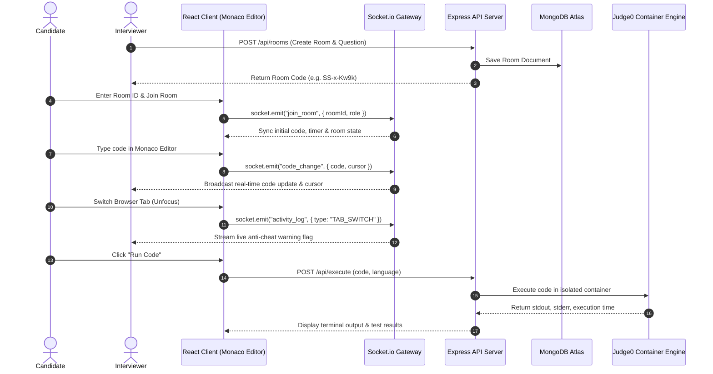

# ⚡ InterviewForge

> **A real-time, technical interview platform engineered for seamless pair programming, live code execution, anti-cheat activity auditing, and automated hiring scorecards.**


---

## 🌟 Overview

**InterviewForge** eliminates the friction of modern technical interviews. Instead of awkward screen sharing on Zoom or copy-pasting code into plain Google Docs, InterviewForge provides a dedicated **collaborative IDE room** where candidates and interviewers can write, execute, debug, and evaluate code in real time.

Built on top of **Microsoft's Monaco Editor**, **WebSockets**, and an isolated **Judge0 sandboxed execution container**, InterviewForge provides granular session controls for interviewers and zero-friction access for candidates.

---

## ✨ Key Features

- 💻 **Real-Time Monaco IDE Synchronization**: Both participants collaborate in the exact code editor engine that powers VS Code — featuring syntax highlighting, line numbers, cursor presence indicators, and multi-language support.
- ▶ **Multi-Language Sandboxed Execution**: Execute **JavaScript (Node.js)**, **Python 3.11**, **C++ 20**, and **Java 17** code instantly via an isolated remote container engine with execution time (ms) and memory benchmarking.
- 🛡️ **Live Anti-Cheat & Activity Feed**: Automatically monitors browser focus loss, tab switching duration, and external text block pasting. Events are streamed live to the interviewer's control panel.
- 🔒 **Granular Session Security**: Interviewers can administrative control the session — lock/unlock candidate input, mute room chat, clear workspace, or terminate the interview.
- ⏱️ **Synchronized Interview Timer**: Start, pause, or extend session countdown timers visible simultaneously on both candidate and interviewer screens.
- 📊 **Post-Interview Scorecards & Transcripts**: Auto-generate evaluation scorecards featuring skill progress meters, interviewer notes, decision recommendations, and exportable transcript logs.
- 🎨 **Developer-First Cyberpunk UI**: Built with a sleek dark palette, custom JetBrains Mono typography, interactive studio showcases, and glassmorphic micro-interactions.

---

## 🛠️ Technology Stack

| Layer | Technology | Usage |
| :--- | :--- | :--- |
| **Frontend Core** | **React 19**, **Vite 8** | Modern UI components with fast HMR & ESM builds |
| **Routing & State** | **React Router DOM v7** | Role-based navigation guards (`/dashboard`, `/join`, `/room`) |
| **Code Editor** | **Monaco Editor React** | VS Code editing experience inside the browser |
| **Styling & UI** | **Tailwind CSS v4**, **PostCSS** | Custom dark design tokens, responsive grid, glassmorphism |
| **Backend API** | **Node.js**, **Express v5** | REST API endpoints for authentication, rooms, and execution |
| **Real-Time Engine** | **Socket.io v4** | Bi-directional WebSockets for real-time code sync & event feeds |
| **Database & ODM** | **MongoDB Atlas**, **Mongoose v9** | Schema models for Users, Interview Rooms, Questions, & Reports |
| **Authentication** | **JWT**, **Bcrypt.js** | Stateless JSON Web Token authorization & password hashing |
| **Execution Sandbox**| **Judge0 API** | Remote multi-language code compiling & test-harness runner |

---

## 🏗️ System Architecture



---

## 🚀 Getting Started

### Prerequisites

- **Node.js**: `v18.0.0` or higher
- **npm**: `v9.0.0` or higher
- **MongoDB**: A running local instance or a free **MongoDB Atlas** connection string.

---

### Installation & Local Setup

#### 1. Clone the repository
```bash
git clone https://github.com/your-username/InterviewForge.git
cd InterviewForge
```

#### 2. Backend Server Setup
```bash
cd server
npm install
```

Create a `.env` file in the `server/` directory:
```env
PORT=4000
MONGODB_URI=mongodb+srv://<username>:<password>@cluster.mongodb.net/interviewforge?retryWrites=true&w=majority
JWT_SECRET=your_super_secret_jwt_key_here
```

Start the backend development server:
```bash
npm start
```
*Backend will run on `http://localhost:4000`*

---

#### 3. Frontend Client Setup
Open a new terminal tab and navigate to the client folder:
```bash
cd client
npm install
```

Create a `.env` file in the `client/` directory:
```env
VITE_API_URL=http://localhost:4000
```

Start the Vite development server:
```bash
npm run dev
```
*Frontend will run on `http://localhost:5173`*

---

## 📡 REST API & Socket Event Reference

### REST API Endpoints

| Method | Endpoint | Description |
| :--- | :--- | :--- |
| `POST` | `/api/auth/register` | Register a new user (`interviewer` or `candidate`) |
| `POST` | `/api/auth/login` | Authenticate user and issue JWT token |
| `POST` | `/api/rooms` | Initialize a new interview room |
| `GET` | `/api/rooms/:roomId` | Retrieve room details & active question |
| `POST` | `/api/execute` | Run arbitrary code via Judge0 execution container |
| `POST` | `/api/execute/tests` | Run code against automated test cases |
| `GET` | `/api/dashboard` | Fetch interviewer analytics & past session history |

### Real-Time Socket Events

| Event Name | Direction | Payload | Description |
| :--- | :--- | :--- | :--- |
| `join_room` | Client ➔ Server | `{ roomId, role, userName }` | Join room socket room instance |
| `code_change` | Client ⇄ Server | `{ roomId, code }` | Broadcast Monaco Editor content updates |
| `cursor_position` | Client ⇄ Server | `{ roomId, cursor }` | Sync live participant cursor locations |
| `activity_log` | Client ➔ Server | `{ roomId, type, message }` | Stream anti-cheat tab-switch/paste events |
| `lock_editor` | Admin ➔ Server | `{ roomId, locked }` | Toggle candidate editor read-only mode |
| `timer_update` | Admin ➔ Server | `{ roomId, remainingSeconds }` | Sync countdown timer state |

---

## 📂 Project Structure

```text
InterviewForge/
├── client/                     # Frontend Application (React 19 + Vite)
│   ├── src/
│   │   ├── assets/             # SVGs and static brand assets
│   │   ├── components/         # Modular UI Components
│   │   │   ├── Chat/           # Live room chat panel
│   │   │   ├── Common/         # Reusable UI primitives (Button, Card, Badge, Input)
│   │   │   ├── Console/        # Code execution terminal drawer
│   │   │   ├── Landing/        # Interactive Studio Showcase tabbed component
│   │   │   ├── Navbar/         # Main sticky navbar with auth modal
│   │   │   ├── Question/       # Question prompt & description viewer
│   │   │   ├── Scorecard/      # Post-interview evaluation form
│   │   │   └── Timer/          # Synchronized countdown clock component
│   │   ├── context/            # AuthContext & ToastContext providers
│   │   ├── pages/              # App routes (Landing, Auth, Dashboards, Join, Room)
│   │   ├── App.jsx             # React Router route registry
│   │   ├── index.css           # Tailwind v4 configuration & theme tokens
│   │   └── main.jsx            # Application entry point
│   └── package.json
│
├── server/                     # Backend Application (Node.js + Express)
│   ├── controllers/            # Request handlers (auth, room, execution, dashboard)
│   ├── models/                 # Mongoose Data Schemas (User, Room, Question, Scorecard)
│   ├── routes/                 # Express API router declarations
│   ├── sockets/                # Socket.io event listeners & broadcaster logic
│   ├── server.js               # Express & HTTP server bootstrapping
│   └── package.json
└── README.md
```

---

## 🚢 Deployment Guide

- **Client (Frontend)**: Deployed on **Vercel** (`npm run build` targeting `dist/`).
- **Server (Backend)**: Deployed on **Render** / **Railway** with environment variables set.
- **Database**: Hosted on **MongoDB Atlas** with IP access whitelist enabled.

---

## 📜 License

Distributed under the **ISC License**. See `LICENSE` for more information.

---

<p center>
  Made with ⚡ for technical interviewers and candidates worldwide.
</p>
